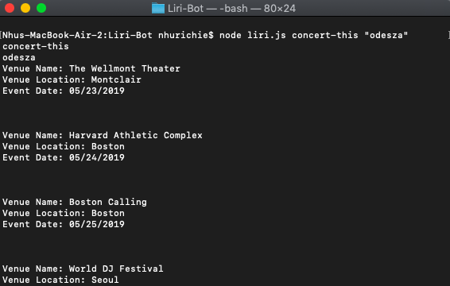

# Liri-Bot
App for Music/Bands/OMBD

# liri-node-app

**Creator**: `Nhu Richie`

**Created**: `2019 May 20`

- - -

## ABOUT APP
LIRI is a Language Interpretation and Recognition Interface. LIRI is a command line node-app that takes in parameters and gives back data. The user has the option of using four commands, which are listed below, in conjuntion with specific parameters associated with the commands. The following four `Commands` are:

   * `concert-this`

   * `spotify-this-song`

   * `movie-this`

   * `do-what-it-says`

- - -
## HOW TO USE LIRI
### **Step by Step instructions**

1. Open your terminal such as Bash.
2. Navigate to the folder that contains the `liri.js` file. 
3. Remember, depending on the command that you run the output will vary. 

    **Example 1**: Run `concert-this` command
    
        node liri.js concert-this 'name of artist or band'
    
    Output from Terminal: The system will display a list of all events and locations where the artist or band will perform. It can result in multiple records. 

    

    **Example 2**: Run `spotify-this-song` command
    
        node liri.js spotify-this-song <name of song>
    
    Output: The system will display a list of information associated with the song. It can result in multiple records. The system will also log all the results in the log.txt file. See screen-shot below:

    

    **Example 3**: Run `movie-this` command
    
        node liri.js movie-this <name of movie>
    
    Output: The system will display information associated with the movie. The system will also log all the results in the log.txt file. See screen-shot below:

    

    **Example 4**: Run `do-what-it-says` command
        
        node liri.js do-what-it-says
        
    Output: The system will read the text in the random.txt file, and perform the command listed in the random.txt file. 
    
    See screen-shot below:

    

- - -

## TECHNOLOGY USED
* Javascript
* NodeJS
* Node packages:
    * Axios (https://www.npmjs.com/package/axios)
    * Dotenv (https://www.npmjs.com/package/dotenv)
    * Moment (https://www.npmjs.com/package/moment)
    * Node-Spotify-API (https://www.npmjs.com/package/node-spotify-api)

### APIs:
  * Spotify (https://developer.spotify.com/)
  * OMDB (http://www.omdbapi.com)
  * Bands In Town (http://www.artists.bandsintown.com/bandsintown-api)
  
* Git
* GitHub